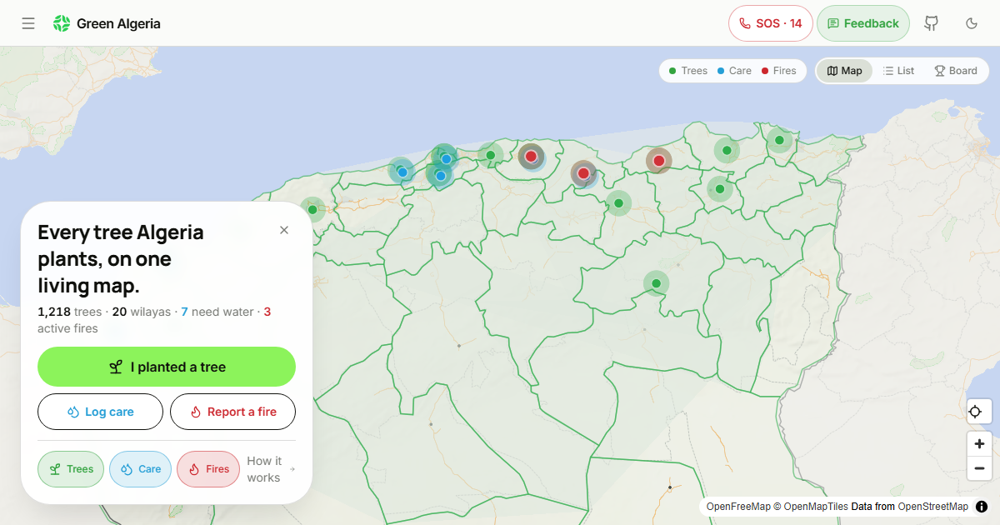

# 🌱 Green Algeria — الجزائر الخضراء

[](LICENSE)
[](https://github.com/Meykiio/dz-green/actions/workflows/ci.yml)

> **الجزائر الخضراء** خريطة حيّة يصنعها المجتمع: غرست شجرة؟ ضعها على الخريطة. سقيتها؟ سجّلها. رأيت حريقًا؟ أبلغ عنه — ويصلك تنبيه إن اشتعل حريق في ولايتك. مجانًا، بلا حساب، بلا إعلانات — من المجتمع، للمجتمع. **[green-dz.vercel.app](https://green-dz.vercel.app)**

**[▶ Use the app — green-dz.vercel.app](https://green-dz.vercel.app)** · Arabic-first interface, English one tap away · free, no account, no ads



## What is this?

Algeria plants trees everywhere — and the proof disappears into social media feeds. Nobody sees the total grow, nobody knows which trees are still watered a month later, and when a fire starts, there's no shared place to see it.

Green Algeria puts all of it on **one living map of the country**: every tree planted, every care visit, every fire — posted by ordinary people, visible to everyone.

**You don't need an account, and it takes under a minute.** If you only remember one thing: **it is not an emergency service** — in danger, call **Protection Civile on 14 or 1021**. We say that on the fire form, on its confirmation screen, and in the SOS panel in the top bar.

## What you can do

**The basics**

- **🌱 Plant a tree** — photo + location (GPS, a pin on the map, a Google Maps link, or just your wilaya). A volunteer moderator in your wilaya reviews it before it appears.
- **💧 Log care** — "I watered it" / "I checked it" on any approved site. Builds a visible timeline, and the map shows which trees are thirsty.
- **🔥 Report a fire** — publishes instantly (speed beats moderation), with the Protection Civile reminder always visible.

**The new stuff**

- **🛰️ Fires by satellite** — NASA's fire detections appear on the map as amber rings, several times a day, even where nobody is there to report. Tap one for its strength, confidence, and the **live weather + smoke** at that spot.
- **🔔 Fire alerts on your phone** — install the app to your home screen, enable alerts for your wilaya (or all of Algeria), and your phone buzzes when a fire is reported. No account, no phone number, and turning it off deletes the subscription from our server.
- **🌿 What to plant in your wilaya** — the plant form suggests trees that actually belong to your area: what's recorded growing there (GBIF biodiversity evidence) matched with your climate, from a guide of 19 Algerian species — with honest warnings (eucalyptus drinks too much; date palms are for oases).
- **📷 Photo → species** — take a photo of your planting, and the app suggests the species (PlantNet botanical engine). One tap fills it in.
- **🗺️ The new administrative map** — all **69 wilayas** with their real borders and **1,541 communes** as proper dropdowns. Zoom all the way out: the whole country finally fits on screen.
- **💧 Rain-aware watering** — the "needs water" badge checks real rainfall: if it rained well on that spot, the tree isn't flagged.

## How it works (why you can trust it)

- **No account needed** for anything public. Plantings are reviewed by volunteer moderators from the same wilaya; fires publish instantly because minutes matter.
- **Your privacy is structural, not promised.** We never store your real IP address (only one-way hashes), phone numbers and names never appear on the public map, and there are no ads and no cross-site tracking.
- **Anonymous receipts** — every submission gives you a private link to check its status later. That's the only way back to it; we can't tell who you are either.
- **Open source** — every line of code and every rule is public in this repo.

## For moderators and volunteers

Volunteers review plantings and triage fires for their own wilaya — a few minutes when you can, from your phone. The app has an admin panel (roles, volunteers, feedback, announcements), wilaya-scoped moderation queues, and a filming privacy mode that masks personal data on staff screens. Apply from the app's **Volunteer** page.

## For developers

<details>
<summary><strong>Stack & local setup</strong></summary>

React 19 + TypeScript, TanStack Start (SSR + server functions), Vite, Tailwind CSS v4, MapLibre GL, Supabase (Postgres + PostGIS, Auth, Storage, Realtime, RLS).

```bash
bun install
cp .env.example .env   # fill in your Supabase values (all vars listed inside)
bun run dev            # http://localhost:5173
bun run test           # 202 unit + component tests
bun run build          # production build
```

Set up the database with [`docs/FULL_SCHEMA_EXPORT.sql`](docs/FULL_SCHEMA_EXPORT.sql) — the canonical schema source (tables, RLS, functions, grants, storage). `supabase/migrations/` is the change record, not a bootstrap path.

First admin is seeded in SQL, then everything (roles, wilayas, volunteers, announcements) is managed from `/admin`:

```sql
INSERT INTO public.user_roles (user_id, role) VALUES ('<your auth user id>', 'admin');
```

</details>

## Documentation

- [`docs/FEATURES.md`](docs/FEATURES.md) — every feature, honestly: what works, what's unverified
- [`docs/DATABASE.md`](docs/DATABASE.md) — tables, columns, every RLS policy in plain English
- [`docs/AUDIT.md`](docs/AUDIT.md) — the security & performance audit
- [`docs/PROJECT_STRUCTURE.md`](docs/PROJECT_STRUCTURE.md) — every file, one line each
- [`docs/CHANGELOG.md`](docs/CHANGELOG.md) — what changed and when (81 passes and counting)
- [`docs/ROADMAP.md`](docs/ROADMAP.md) — what's next, what's parked, and why

## Contributing

Contributions welcome — read [`CONTRIBUTING.md`](CONTRIBUTING.md) first. Bugs go through the issue templates; bigger ideas start as an issue before any code.

## License

[AGPL-3.0](LICENSE) — Copyright © 2026 Sifeddine Mebarki ([Meykiio](https://github.com/Meykiio)), Algiers, Algeria.
